<p align="center">
  <a href="https://github.com/erick-g-c">
    
  </a>
</p>

<p align="center"></p>

### `// 01 — SOBRE_MÍ`

<p align="center">
  
</p>

```txt
▸ Desarrollo y mantenimiento web
▸ Mejorando constantemente en frontend y buenas prácticas
▸ Explorando nuevas herramientas y frameworks
▸ Pregúntame sobre JavaScript, TypeScript, HTML/CSS y Astro
```

<p align="center"></p>

### `// 02 — STACK`

<p align="center">
  
  
  
  
  
  
</p>

<p align="center"></p>

### `// 03 — STATS`

<!-- Tarjetas generadas por .github/workflows/readme-cards.yml y guardadas en este repo (no dependen de servicios externos) -->
<p align="center">
  
  
</p>

<p align="center">
  
</p>

<p align="center"></p>

### `// 04 — ACTIVIDAD`

<!-- GIF generado por .github/workflows/snake.yml en la rama output -->
<p align="center">
  
</p>

<p align="center"></p>

<p align="center">
  
</p>

<p align="center"><sub><code>&gt; conexión establecida desde Night City · CDMX_</code></sub></p>
